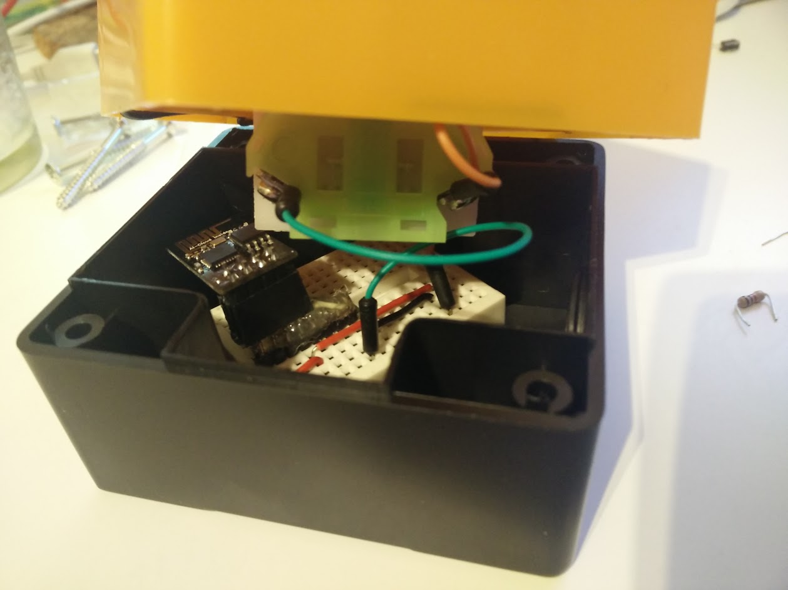
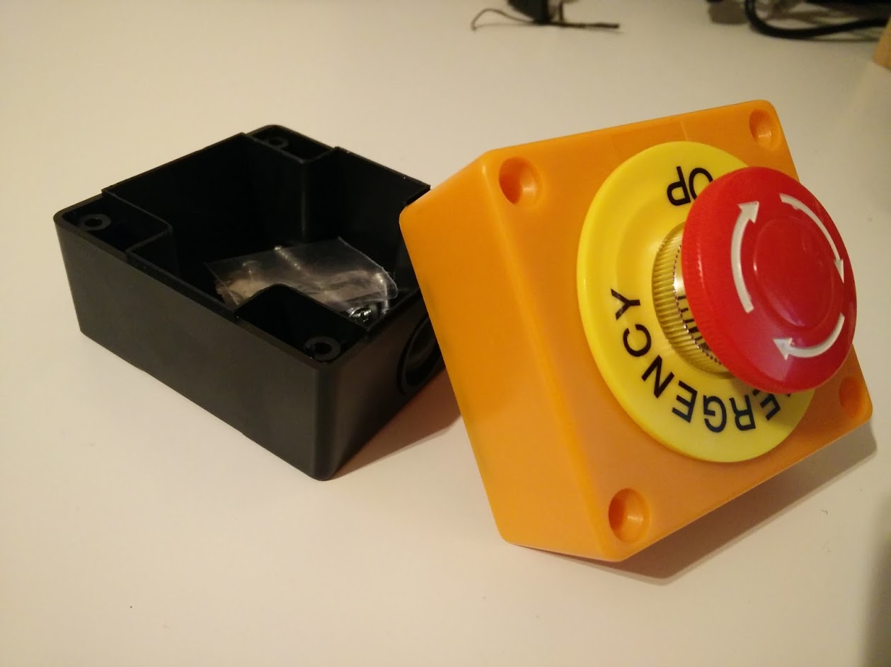
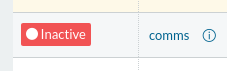
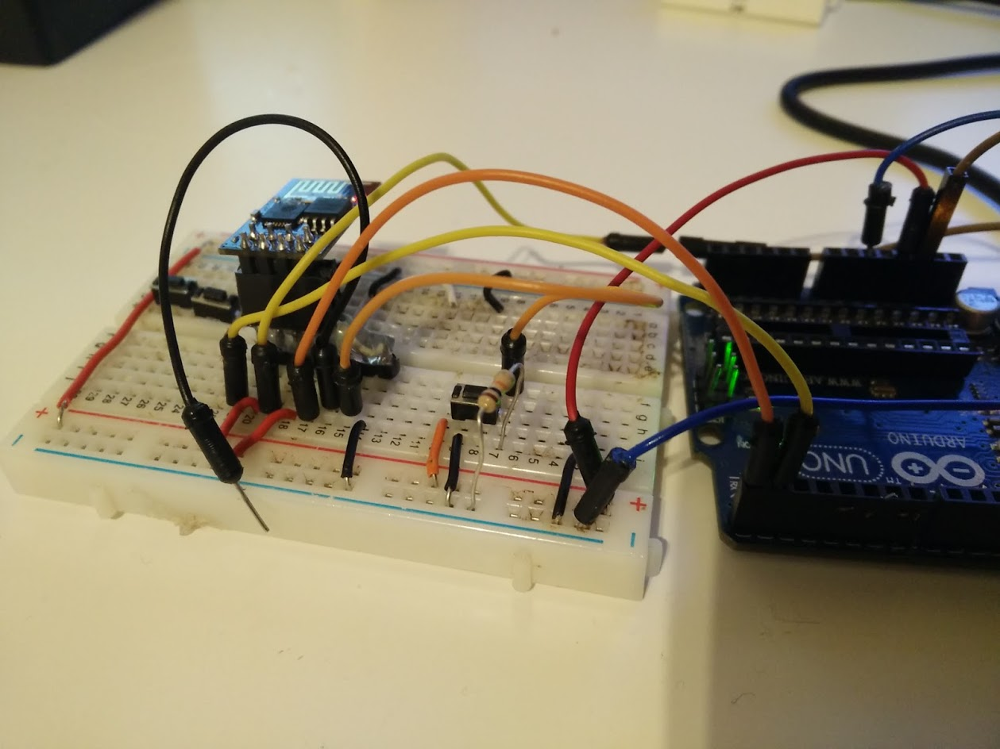

## Emergency STOP button

Implement a wireless STOP button to stop your services or whatever you want to
activate using a web client.

In this case, I used this button to stop services on Rancher, just for fun.

## Hardware

* Big red button (connected to GPIO2 on ESP8266)
* ESP8266 (model ESP-01)
* LiPo battery 240mah

